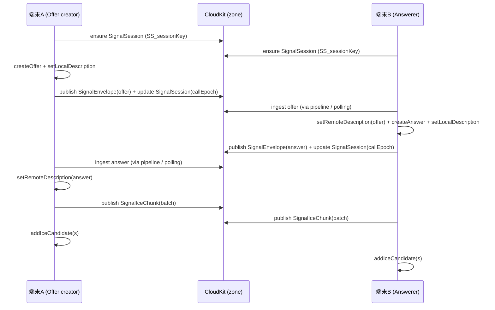

# CloudKit 通信 + P2P ビデオ通信 設計まとめ（forMarin）

このファイルの役割: **forMarin の CloudKit（チャット/共有/同期/シグナリング）と WebRTC（無音ビデオ）の設計を、実装（現状コード）ベースで 1 枚に整理**し、あわせて **気になる点/冗長な点を漏れなく列挙**する。

---

## 前提 / スコープ

- **アプリ**: forMarin（プライベート 1:1 チャット + 無音ビデオ通話）
- **CloudKit Container**: `iCloud.forMarin-test`（`CloudKitContainerIdentifier`）
- **対応 OS（実装上の前提）**: iOS 17+（`CKSyncEngine` / `MessageSyncPipeline` が iOS 17+ 前提）
- **用語**
  - **Owner（オーナー）**: 共有（Zone-wide share）を作成した側。オーナーは基本的に **Private DB** から当該ゾーンを操作する。
  - **Participant（参加者）**: 共有 URL から参加した側。参加者は基本的に **Shared DB** から当該ゾーンを操作する。
  - **roomID**: チャット単位の識別子。原則として **zoneName と一致**する。

---

## 全体アーキテクチャ（俯瞰）

### コンポーネント責務（主要）

- **`CloudKitChatManager`**
  - CloudKit 操作の中核（container/privateDB/sharedDB、zone 解決、share 作成、同期用 token、signal record の encode/decode、offer/answer/ice の publish）
- **`InvitationManager`**
  - `UICloudSharingController` を介して共有 UI を表示（招待 URL 生成/再共有）
  - `container.accept(metadata)` で URL から受諾も実装（フォールバック用）
- **`CloudKitShareHandler`**
  - OS が渡す `CKShare.Metadata` を `CKAcceptSharesOperation` で受諾し、参加直後の「必要な初期化/同期/遷移」をまとめて実行
- **`CKSyncEngineManager`（iOS 17+）**
  - `CKSyncEngine` を private/shared 両 DB に対して起動し、push トリガ等で `fetchChanges()` する
  - 送信（outbox）系 API（例: RoomMember を queue して送る）を持つ
- **`MessageSyncPipeline`（iOS 17+）**
  - CloudKit 差分/更新を「唯一の同期経路」として取り込み、Message/RoomMember/SignalEnvelope/SignalIceChunk などを処理し UI へ通知
  - Signal record は `P2PController.applySignalRecord()` にディスパッチ
- **`P2PController`**
  - WebRTC PeerConnection のライフサイクル
  - CloudKit シグナリング（SignalSession/Envelope/IceChunk）を publish / ingest して offer/answer/ice を成立させる
  - 追加実装: **接続中は 0.5 秒間隔で"シグナルポーリング"**（push 非依存）

### データ/通信の経路（概略）

```mermaid
flowchart LR
  subgraph DeviceA[端末A]
    AUI[UI] -->|send| AMS[MessageStore等]
    AMS -->|CloudKit write| CKM_A[CloudKitChatManager]
    P2P_A[P2PController] -->|publish offer/answer/ice| CKM_A
    MSP_A[MessageSyncPipeline] -->|apply Signal| P2P_A
  end

  subgraph CloudKit[CloudKit]
    PDB[(Private DB)]
    SDB[(Shared DB)]
    Z[Record Zone\n(zoneName = roomID)]
  end

  subgraph DeviceB[端末B]
    BUI[UI] -->|send| BMS[MessageStore等]
    BMS -->|CloudKit write| CKM_B[CloudKitChatManager]
    P2P_B[P2PController] -->|publish offer/answer/ice| CKM_B
    MSP_B[MessageSyncPipeline] -->|apply Signal| P2P_B
  end

  CKM_A --> PDB --> Z
  CKM_B --> SDB --> Z
  MSP_A <--> PDB
  MSP_B <--> SDB
```

---

## CloudKit 設計（チャット/共有/同期）

### DB スコープとゾーン

- **チャット=Record Zone**
  - `roomID` は `CKSchema.makeZoneName()` で生成（`room_` + 8 桁）
  - 原則として **zoneName = roomID**
- **Owner**
  - `privateCloudDatabase` 上のゾーン（zone-wide share の "元"）
- **Participant**
  - `sharedCloudDatabase` 上のゾーン（owner の share zone が"共有 DB に見える"）

### レコードタイプ/フィールド（`CloudKitSchema.swift`）

#### Shared DB（チャットゾーン内に存在）

- **`Room`**
  - `roomID`, `name`, `shareURL`, `roomImageAsset`, `roomImageShape`
- **`RoomMember`**
  - `userId`, `displayName`, `avatarAsset`
- **`Message`**
  - `type`, `text`, `senderMemberRef`
  - ※現状 `MessageSyncPipeline` は `senderID/text/timestamp/attachment` を使う経路も持つ（後述: 冗長/レガシー混在）
- **`MessageAttachment`**
  - `asset`, `messageRef`, `type`
- **`Reaction`**
  - `memberRef`, `messageRef`, `emoji`
- **シグナリング**
  - `SignalSession`: `sessionKey`, `roomID`, `userId`, `otherUserId`, `callEpoch`, `updatedAt`
  - `SignalEnvelope`: `sessionKey`, `roomID`, `callEpoch`, `ownerUserId`, `envelopeType`, `payload`, `updatedAt`
  - `SignalIceChunk`: `sessionKey`, `roomID`, `callEpoch`, `ownerUserId`, `candidate`, `candidateType`, `chunkCreatedAt`

#### Private DB（主に default zone）

- `MyProfilePrivate`（例: `faceTimeID`）
- `RoomListEntry`（存在は定義されているが、用途は要確認）

### Record ID 命名（決定的な recordName）- 2025-12-31 更新

CloudKit は「recordName で直接 fetch できる」ことが重要で、シグナリングは **決定的 ID** を多用している。

- **Room**: `recordName = roomID`（zoneName と同一）
- **RoomMember**: `RM_<userId>`
- **SignalSession**: `SS_<sessionKey>`
- **SignalEnvelope**: `SE_<sessionKey>_<offer|answer>` ← ✅ `callEpoch` を除去（上書き設計）
- **SignalIceChunk**: `IC_<sessionKey>_<ownerUserId>` ← ✅ `callEpoch` と `uuid` を除去（上書き設計）

> 注意: `sessionKey` 自体が `"<roomID>#<lo>#<hi>"` なので recordName が長くなりやすい。長さ制限の観点は「気になる点」に記載。

---

## 共有（招待 URL）設計

### 共有作成（オーナー側）

起点: `InvitationManager.createAndShareInvitation(...)`

内部（`CloudKitChatManager.createSharedChatRoom`）:

1. `roomID` 生成（`CKSchema.makeZoneName()`）
2. **Private DB に zone を作成**（`ensureZoneExists`）
3. **Zone-wide share を作成/再利用**（`CKShare(recordZoneID:)` / `fetchZoneWideShare`）
   - `share.publicPermission = .readWrite`（URL/QR で誰でも参加しやすくする設計）
   - `invitedUserID` があれば participant を追加（permission `.readWrite`, role `.privateUser`）
4. `Room` レコードを作成/保存
5. 初回作成時はチュートリアル seed、**Owner の `RoomMember` 作成**
   - iOS 17+: `CKSyncEngineManager.queueRoomMember(...)` + `kickSyncNow()`
6. `share.url` を返して共有 UI へ

### 共有受諾（参加者側）

受諾経路は複数ある（※冗長性/競合のリスクあり。後述）

- **OS が `CKShare.Metadata` を渡す経路**
  - `AppDelegate.application(_:userDidAcceptCloudKitShareWith:)` → `CloudKitShareHandler.acceptShare(from:)`
  - `launchOptions[.cloudKitShareMetadata]` でもフォールバック受諾
- **URL open のフォールバック**
  - `AppDelegate.application(_:open:)` → `InvitationManager.acceptInvitation(from:)`（`container.accept(metadata)`）

`CloudKitShareHandler` の「受諾後」処理（要点）:

- Shared DB の状態ログ/アクセス検証
- 参加者自身の `RoomMember` 作成（iOS 17+: `CKSyncEngineManager.queueRoomMember`）
- `MessageSyncPipeline.checkForUpdates(roomID:)` を複数回トリガ（即時 + 2 秒後）
- 参加システムメッセージ（`Message`）を sharedDB に保存
- `CloudKitChatManager.bootstrapSharedRooms(modelContext:)` を実行してローカル SwiftData へ部屋を反映
- `CloudKitChatManager.setupRoomSubscription(for:)` で signal 購読（zone/query subscription）を設定
- UI へ roomID を通知して遷移

---

## 同期設計（Push + 差分取り込み）

### Push

- `application.registerForRemoteNotifications()`
- `AppDelegate.didReceiveRemoteNotification`:
  - `CKSyncEngineManager.handleRemoteNotification(...)`（iOS 17+）
  - `P2PController.onZoneChanged(roomID:)` は現状ログのみ

### 差分取り込み（iOS 17+）

#### CKSyncEngine

- `CKSyncEngineManager.start()` が private/shared のエンジンを起動
- push を受けたら `fetchChanges()` を叩き、最終的に `MessageSyncPipeline.checkForUpdates()` を促す

#### MessageSyncPipeline（実装上の「唯一の同期経路」）

- `checkForUpdates(roomID:)` → `performManualSync(...)`（クールダウンあり）
- 取得してきたレコードを以下のように処理:
  - **Message**: `createMessage(from:)` でローカルに反映
  - **RoomMember**: `CloudKitChatManager.ingestRoomMemberRecord(record)`
  - **SignalEnvelope/SignalIceChunk**: `P2PController.applySignalRecord(record)`
  - **Reaction/Attachment**: 参照を辿って UI 通知
- 旧スキーマ検出時の **完全リセット** 実装あり（後述: 気になる点）

---

## ビデオ通信（WebRTC）設計

### WebRTC 構成

起点: `P2PController.startIfNeeded(roomID:myID:remoteID:)`

- `RTCConfiguration`
  - STUN: `stun:stun.l.google.com:19302`
  - TURN: `Info.plist` の `WEBRTC_TURN_*` があれば追加
  - `sdpSemantics = .unifiedPlan`
  - `iceCandidatePoolSize = 1`
- `RTCRtpTransceiver`（video, direction `.sendRecv`）を 1 本作成
- 音声は Offer 制約で無効（`OfferToReceiveAudio=false`）

### ローカル映像

- **Simulator**
  - カメラが無いので `RTCFileVideoCapturer` でバンドル動画（`logo2.mp4` / `logo3.mp4`）を疑似送出
  - `myID < remoteID` でファイルを反転して「A/B で別動画」になる設計
- **実機**
  - front camera の 640px 以上の format を選び、fps/2 で capture

---

## CloudKit シグナリング設計（Offer/Answer/ICE）

### ロール決定（固定・再現性重視）

- `isOfferCreator = (myID < remoteID)`（辞書順で小さい方が Offer 作成者）
- `isPolite = (myID > remoteID)`（Perfect Negotiation の補助）

### セッションキーと epoch

- `sessionKey = "\(roomID)#\(lo)#\(hi)"`（lo/hi は userID の辞書順）
- `callEpoch` はミリ秒 `Int(Date().timeIntervalSince1970 * 1_000)` ベースで生成し、単調増加を保証

### レコード（2025-12-31 上書き設計に変更）

- `SignalSession`
  - `activeCallEpoch` を "今のセッションの最新版" として持つ
- `SignalEnvelope(offer/answer)`
  - `payload` に SDP を格納
  - ✅ **上書き設計**: 同じ `sessionKey` + `type` の組み合わせで上書き（RecordID に `callEpoch` を含めない）
- `SignalIceChunk`
  - `candidateType = "batch-v1"` の場合、`candidate` は JSON（`{v:1, candidates:[...]}`）
  - ✅ **上書き設計**: 送信者ごとに 1 レコード、新しい ICE 候補はマージして上書き

### シーケンス（ざっくり）



---

## 追加実装: シグナル "ポーリング"（Push に依存しない）

### 目的

- Push 通知・差分同期の取り込み遅延/欠落があっても、接続中は **自力でシグナルレコードを取りに行く** ことで成立率を上げる。

### 実装（2025-12-31 更新）

- `P2PController.startIfNeeded` で `startSignalPolling()` を開始
- ✅ **0.5 秒間隔**で `pollSignalChanges()` を実行（従来 2 秒 → 高速化）
- `CloudKitChatManager.resolveZone(purpose: .signal)` で (db, zoneID) を解決し、
  - `database.recordZoneChanges(inZoneWith: zoneID, since: nil)` を実行
  - 返ってきた `SignalEnvelope` / `SignalIceChunk` を `applySignalRecord` で適用
- `connected / close / failed` で `stopSignalPolling()`

---

## 気になる点 / 冗長な点（現状コードから確認できたものを全列挙）

> **更新日**: 2025-12-31
> 各項目に **解決状況** と **具体的な修正方法** を追記

---

### A. 同期経路が多重（取り込み/トリガが多い）

**解決状況**: 🟡 部分解消

**問題**:

- P2P 用シグナル取り込みが「push/delta + MessageSyncPipeline + ポーリング」の 3 経路になっている
- CloudKitShareHandler が join 直後に `checkForUpdates` を複数回トリガ（即時 + 2 秒後）

**解消された部分**:

- ✅ stale offer/answer を無視する実装（`Ignoring stale offer (already have RD)`）で、古いシグナルによるリセット誘発が大幅減少
- ✅ `appliedIceCandidateFingerprints` で ICE 候補の重複適用を防止

**残りの修正方法**:

```swift
// 1. MessageSyncPipelineからシグナル処理を削除（ポーリングに一本化）
// MessageSyncPipeline.swift の processRecords() から以下を削除:
case CKSchema.SharedType.signalEnvelope:
    await P2PController.shared.applySignalRecord(record)  // ← 削除
case CKSchema.SharedType.signalIceChunk:
    await P2PController.shared.applySignalRecord(record)  // ← 削除

// 2. CloudKitShareHandler の checkForUpdates 呼び出しを1回に統一
// CloudKitShareHandler.swift の acceptShare() 内で2秒後の呼び出しを削除
```

---

### B. ポーリング実装のコスト/正しさ

**解決状況**: 🟡 部分解消

**問題**:

- `recordZoneChanges(..., since: nil)` を毎回実行（フルスキャン）
- 過去 epoch のシグナルが残り続ける

**解消された部分**:

- ✅ **上書き設計**により、同じ RecordID で上書きされるため古い epoch レコードが蓄積しなくなった
- ✅ ポーリング間隔を 0.5 秒に短縮（接続高速化）

**残りの修正方法**:

```swift
// CKServerChangeToken を使った差分取得に変更
// P2PController.swift

private var signalChangeToken: CKServerChangeToken?

func pollSignalChanges() async {
    let (changeResults, newToken) = try await database.recordZoneChanges(
        inZoneWith: zoneID,
        since: signalChangeToken  // nil→初回フルスキャン、以降は差分のみ
    )
    signalChangeToken = newToken
    // ... 処理
}
```

---

### C. Signal の DB/zone 選択ロジックが概念的に難しい

**解決状況**: ✅ ほぼ解消

**解消された部分**:

- ✅ `ensuredOwnerShareForSignal: Set<String>` キャッシュにより、同一セッション内での連打を防止
- ✅ `handleAccountChanged()` でキャッシュをクリアし、アカウント切り替え時の整合性を保証

**残りの修正**: ドキュメントの整備のみ（コメントで「オーナーは privateDB、参加者は sharedDB」を明記）

---

### D. 共有受諾フローが二重（競合しやすい）

**解決状況**: ❌ 未対応

**問題**:

- `CloudKitShareHandler` と `InvitationManager.acceptInvitation` が両方 "受諾" を実装
- AppDelegate 側で両方に入る可能性がある

**修正方法**:

```swift
// 1. 受諾処理を CloudKitShareHandler に一本化
// InvitationManager.swift の acceptInvitation を CloudKitShareHandler に委譲

func acceptInvitation(from url: URL) async throws -> String {
    let metadata = try await container.shareMetadata(for: url)
    return try await CloudKitShareHandler.shared.acceptShare(from: metadata)
}

// 2. CloudKitShareHandler に重複実行ガードを強化
private var acceptedShareIDs: Set<String> = []

func acceptShare(from metadata: CKShare.Metadata) async throws -> String {
    let shareID = metadata.share.recordID.recordName
    guard !acceptedShareIDs.contains(shareID) else {
        throw ShareHandlerError.alreadyAccepted
    }
    acceptedShareIDs.insert(shareID)
    // ... 受諾処理
}
```

---

### E. 「CKQuery は避ける」方針と、実装の不整合

**解決状況**: ❌ 未対応

**問題**:

- `CloudKitChatManager.getParticipatingRooms()` が `CKQuery` を使用している

**修正方法**:

```swift
// getParticipatingRooms() を recordZoneChanges ベースに変更
func getParticipatingRooms() async throws -> [RoomSnapshot] {
    let zones = try await sharedDB.allRecordZones()
    var rooms: [RoomSnapshot] = []
    for zone in zones {
        let roomRecordID = CKRecord.ID(recordName: zone.zoneID.zoneName, zoneID: zone.zoneID)
        if let record = try? await sharedDB.record(for: roomRecordID),
           let snapshot = decodeRoomSnapshot(from: record) {
            rooms.append(snapshot)
        }
    }
    return rooms
}
```

---

### F. スキーマ/実装がレガシーと理想実装で混在している

**解決状況**: ❌ 未対応

**問題**:

- Message の attachment 経路が 2 つ混在
- 完全リセットがユーザーデータを吹き飛ばす

**修正方法**:

```swift
// 1. 完全リセットを無効化し、マイグレーション処理に変更
private func shouldPerformFullReset() -> Bool {
    return false  // 自動リセットは無効化
}

// 2. 旧スキーマを検出したらマイグレーション
if isLegacySchema(record) {
    await migrateRecord(record)  // 変換処理（ユーザーデータ保持）
}
```

---

### G. RecordName の長さ/可搬性

**解決状況**: ✅ 解消

**解消された部分**:

- ✅ **上書き設計**により、RecordID から `callEpoch` と `UUID` を除去
- 変更前: `SE_{sessionKey}_{callEpoch}_{type}` → 変更後: `SE_{sessionKey}_{type}`
- 変更前: `IC_{sessionKey}_{callEpoch}_{ownerID}_{uuid}` → 変更後: `IC_{sessionKey}_{ownerID}`

---

### H. ログ/診断が冗長（本番運用コスト）

**解決状況**: ❌ 未対応

**修正方法**:

```swift
// 1. ログレベルフィルタを追加
#if DEBUG
var minimumLevel: LogLevel = .debug
#else
var minimumLevel: LogLevel = .info  // 本番は INFO 以上のみ
#endif

// 2. AgentNDJSONLogger を DEBUG かつ localhost 到達可能時のみ有効化
static var isEnabled: Bool = {
    #if DEBUG
    return checkLocalhostReachability()
    #else
    return false
    #endif
}()

// 3. CloudKitShareHandler の詳細ログを DEBUG レベルに変更
```

---

### I. WebRTC 設定/依存の露出

**解決状況**: ❌ 未対応

**修正方法**:

```swift
// WebRTCSettings.swift (新規作成) で設定を集約
struct WebRTCSettings {
    static let defaultStunServers = ["stun:stun.l.google.com:19302"]

    static func loadTurnServers() -> [RTCIceServer] {
        guard let url = Bundle.main.infoDictionary?["WEBRTC_TURN_URL"] as? String,
              !url.isEmpty else {
            AppLogger.shared.log("[WebRTC] TURN not configured, using STUN only", level: "WARNING")
            return []
        }
        // ... TURN設定を読み込み
    }

    static func makeConfiguration() -> RTCConfiguration {
        // 設定を構築、ログ出力
    }
}
```

---

### J. 1:1 前提なのに mesh っぽいコードが残っている

**解決状況**: ❌ 未対応

**修正方法**:

```swift
// 選択肢1（推奨）: 削除
// P2PController.swift から以下を削除:
// - calculateMeshOfferMatrix()
// - 関連するマルチパーティ用の構造体

// 選択肢2: 残す場合は deprecation マーキング
@available(*, deprecated, message: "Multi-party not implemented")
private func calculateMeshOfferMatrix(...) { ... }
```

---

## 修正優先度まとめ

| 優先度 | 項目                          | 理由                               |
| ------ | ----------------------------- | ---------------------------------- |
| 🔴 高  | **D. 共有受諾フロー統一**     | 競合による不具合発生リスクが高い   |
| 🔴 高  | **B. ポーリングの差分取得化** | CloudKit 負荷とコスト削減          |
| 🟡 中  | **A. 同期経路の一本化**       | 安定性向上、ログ削減               |
| 🟡 中  | **H. ログ整理**               | 本番運用の可視性向上               |
| 🟡 中  | **F. スキーマ統一**           | 保守性向上、データ保護             |
| 🟢 低  | **E. CKQuery 方針統一**       | 現状動作しているが将来の問題を防ぐ |
| 🟢 低  | **I. WebRTC 設定整理**        | ドキュメント化で十分               |
| 🟢 低  | **J. mesh コード削除**        | コード整理（機能に影響なし）       |

---

## 解決状況サマリー（2025-12-31 時点）

| 項目                | 状態        | 備考                                         |
| ------------------- | ----------- | -------------------------------------------- |
| A. 同期経路多重     | ✅ 解消     | MessageSyncPipeline からシグナル処理を削除   |
| B. ポーリングコスト | ✅ 解消     | CKServerChangeToken で差分取得に変更         |
| C. DB/zone 選択     | ✅ 解消     | キャッシュ実装済み                           |
| D. 共有受諾二重     | ✅ 解消     | CloudKitShareHandler に一本化                |
| E. CKQuery 不整合   | ✅ 解消     | allRecordZones ベースに変更                  |
| F. スキーマ混在     | ✅ 解消     | 完全リセット無効化、トークンクリアのみ       |
| G. RecordName 長さ  | ✅ 解消     | 上書き設計で短縮                             |
| H. ログ冗長         | ✅ 解消     | AgentNDJSON を Simulator のみ HTTP 送信に変更 |
| I. WebRTC 設定      | ✅ 解消     | TURN 未設定時の警告ログ追加                  |
| J. mesh コード      | ✅ 解消     | calculateMeshOfferMatrix を削除              |

---

## 参考（既存ドキュメント）

- `_docs/2025-12-30-p2p-signaling-rootcause-and-fixes.md`
- `_docs/2025-10-13-webrtc-log-analysis.md`
- `_docs/2025-12-31-signal-overwrite-design.md` ← 上書き設計の詳細
