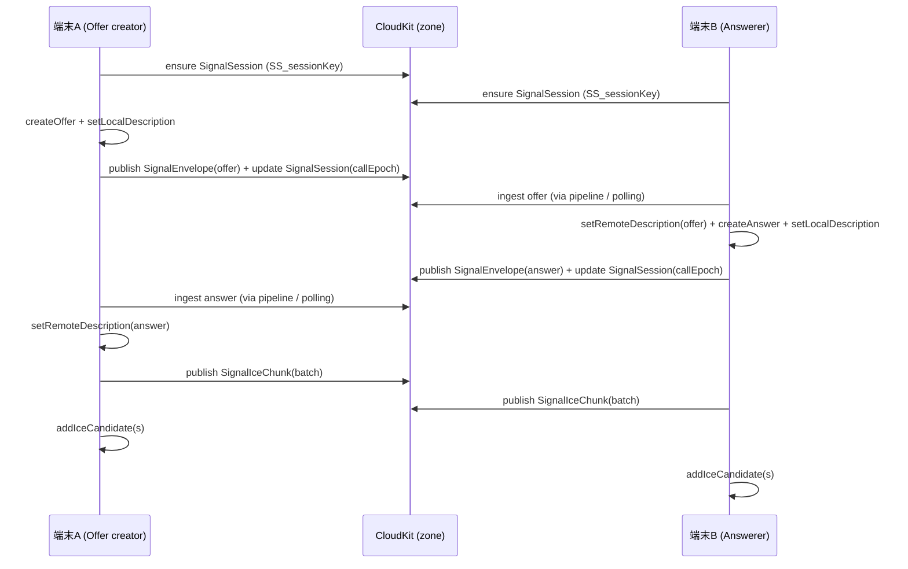

# CloudKit通信 + P2Pビデオ通信 設計まとめ（forMarin）

このファイルの役割: **forMarin の CloudKit（チャット/共有/同期/シグナリング）と WebRTC（無音ビデオ）の設計を、実装（現状コード）ベースで1枚に整理**し、あわせて **気になる点/冗長な点を漏れなく列挙**する。

---

## 前提 / スコープ

- **アプリ**: forMarin（プライベート 1:1 チャット + 無音ビデオ通話）
- **CloudKit Container**: `iCloud.forMarin-test`（`CloudKitContainerIdentifier`）
- **対応OS（実装上の前提）**: iOS 17+（`CKSyncEngine` / `MessageSyncPipeline` が iOS 17+ 前提）
- **用語**
  - **Owner（オーナー）**: 共有（Zone-wide share）を作成した側。オーナーは基本的に **Private DB** から当該ゾーンを操作する。
  - **Participant（参加者）**: 共有URLから参加した側。参加者は基本的に **Shared DB** から当該ゾーンを操作する。
  - **roomID**: チャット単位の識別子。原則として **zoneName と一致**する。

---

## 全体アーキテクチャ（俯瞰）

### コンポーネント責務（主要）

- **`CloudKitChatManager`**
  - CloudKit操作の中核（container/privateDB/sharedDB、zone解決、share作成、同期用token、signal recordのencode/decode、offer/answer/iceのpublish）
- **`InvitationManager`**
  - `UICloudSharingController` を介して共有UIを表示（招待URL生成/再共有）
  - `container.accept(metadata)` でURLから受諾も実装（フォールバック用）
- **`CloudKitShareHandler`**
  - OSが渡す `CKShare.Metadata` を `CKAcceptSharesOperation` で受諾し、参加直後の「必要な初期化/同期/遷移」をまとめて実行
- **`CKSyncEngineManager`（iOS 17+）**
  - `CKSyncEngine` を private/shared 両DBに対して起動し、pushトリガ等で `fetchChanges()` する
  - 送信（outbox）系API（例: RoomMemberをqueueして送る）を持つ
- **`MessageSyncPipeline`（iOS 17+）**
  - CloudKit差分/更新を「唯一の同期経路」として取り込み、Message/RoomMember/SignalEnvelope/SignalIceChunk などを処理しUIへ通知
  - Signal recordは `P2PController.applySignalRecord()` にディスパッチ
- **`P2PController`**
  - WebRTC PeerConnectionのライフサイクル
  - CloudKitシグナリング（SignalSession/Envelope/IceChunk）を publish / ingest して offer/answer/ice を成立させる
  - 追加実装: **接続中は2秒間隔で“シグナルポーリング”**（push非依存）

### データ/通信の経路（概略）

```mermaid
flowchart LR
  subgraph DeviceA[端末A]
    AUI[UI] -->|send| AMS[MessageStore等]
    AMS -->|CloudKit write| CKM_A[CloudKitChatManager]
    P2P_A[P2PController] -->|publish offer/answer/ice| CKM_A
    MSP_A[MessageSyncPipeline] -->|apply Signal| P2P_A
  end

  subgraph CloudKit[CloudKit]
    PDB[(Private DB)]
    SDB[(Shared DB)]
    Z[Record Zone\n(zoneName = roomID)]
  end

  subgraph DeviceB[端末B]
    BUI[UI] -->|send| BMS[MessageStore等]
    BMS -->|CloudKit write| CKM_B[CloudKitChatManager]
    P2P_B[P2PController] -->|publish offer/answer/ice| CKM_B
    MSP_B[MessageSyncPipeline] -->|apply Signal| P2P_B
  end

  CKM_A --> PDB --> Z
  CKM_B --> SDB --> Z
  MSP_A <--> PDB
  MSP_B <--> SDB
```

---

## CloudKit設計（チャット/共有/同期）

### DBスコープとゾーン

- **チャット=Record Zone**
  - `roomID` は `CKSchema.makeZoneName()` で生成（`room_` + 8桁）
  - 原則として **zoneName = roomID**
- **Owner**
  - `privateCloudDatabase` 上のゾーン（zone-wide shareの “元”）
- **Participant**
  - `sharedCloudDatabase` 上のゾーン（ownerのshare zoneが“共有DBに見える”）

### レコードタイプ/フィールド（`CloudKitSchema.swift`）

#### Shared DB（チャットゾーン内に存在）

- **`Room`**
  - `roomID`, `name`, `shareURL`, `roomImageAsset`, `roomImageShape`
- **`RoomMember`**
  - `userId`, `displayName`, `avatarAsset`
- **`Message`**
  - `type`, `text`, `senderMemberRef`
  - ※現状 `MessageSyncPipeline` は `senderID/text/timestamp/attachment` を使う経路も持つ（後述: 冗長/レガシー混在）
- **`MessageAttachment`**
  - `asset`, `messageRef`, `type`
- **`Reaction`**
  - `memberRef`, `messageRef`, `emoji`
- **シグナリング**
  - `SignalSession`: `sessionKey`, `roomID`, `userId`, `otherUserId`, `callEpoch`, `updatedAt`
  - `SignalEnvelope`: `sessionKey`, `roomID`, `callEpoch`, `ownerUserId`, `envelopeType`, `payload`, `updatedAt`
  - `SignalIceChunk`: `sessionKey`, `roomID`, `callEpoch`, `ownerUserId`, `candidate`, `candidateType`, `chunkCreatedAt`

#### Private DB（主に default zone）

- `MyProfilePrivate`（例: `faceTimeID`）
- `RoomListEntry`（存在は定義されているが、用途は要確認）

### Record ID命名（決定的なrecordName）

CloudKitは「recordNameで直接fetchできる」ことが重要で、シグナリングは **決定的ID** を多用している。

- **Room**: `recordName = roomID`（zoneNameと同一）
- **RoomMember**: `RM_<userId>`
- **SignalSession**: `SS_<sessionKey>`
- **SignalEnvelope**: `SE_<sessionKey>_<callEpoch>_<offer|answer>`
- **SignalIceChunk**: `IC_<sessionKey>_<callEpoch>_<ownerUserId>_<uuid>`

> 注意: `sessionKey` 自体が `"<roomID>#<lo>#<hi>"` なので recordName が長くなりやすい。長さ制限の観点は「気になる点」に記載。

---

## 共有（招待URL）設計

### 共有作成（オーナー側）

起点: `InvitationManager.createAndShareInvitation(...)`

内部（`CloudKitChatManager.createSharedChatRoom`）:

1. `roomID` 生成（`CKSchema.makeZoneName()`）
2. **Private DBに zone を作成**（`ensureZoneExists`）
3. **Zone-wide share を作成/再利用**（`CKShare(recordZoneID:)` / `fetchZoneWideShare`）
   - `share.publicPermission = .readWrite`（URL/QRで誰でも参加しやすくする設計）
   - `invitedUserID` があれば participant を追加（permission `.readWrite`, role `.privateUser`）
4. `Room` レコードを作成/保存
5. 初回作成時はチュートリアルseed、**Ownerの `RoomMember` 作成**
   - iOS 17+: `CKSyncEngineManager.queueRoomMember(...)` + `kickSyncNow()`
6. `share.url` を返して共有UIへ

### 共有受諾（参加者側）

受諾経路は複数ある（※冗長性/競合のリスクあり。後述）

- **OSが `CKShare.Metadata` を渡す経路**
  - `AppDelegate.application(_:userDidAcceptCloudKitShareWith:)` → `CloudKitShareHandler.acceptShare(from:)`
  - `launchOptions[.cloudKitShareMetadata]` でもフォールバック受諾
- **URL open のフォールバック**
  - `AppDelegate.application(_:open:)` → `InvitationManager.acceptInvitation(from:)`（`container.accept(metadata)`）

`CloudKitShareHandler` の「受諾後」処理（要点）:

- Shared DBの状態ログ/アクセス検証
- 参加者自身の `RoomMember` 作成（iOS 17+: `CKSyncEngineManager.queueRoomMember`）
- `MessageSyncPipeline.checkForUpdates(roomID:)` を複数回トリガ（即時 + 2秒後）
- 参加システムメッセージ（`Message`）を sharedDB に保存
- `CloudKitChatManager.bootstrapSharedRooms(modelContext:)` を実行してローカルSwiftDataへ部屋を反映
- `CloudKitChatManager.setupRoomSubscription(for:)` で signal購読（zone/query subscription）を設定
- UIへ roomID を通知して遷移

---

## 同期設計（Push + 差分取り込み）

### Push

- `application.registerForRemoteNotifications()`
- `AppDelegate.didReceiveRemoteNotification`:
  - `CKSyncEngineManager.handleRemoteNotification(...)`（iOS 17+）
  - `P2PController.onZoneChanged(roomID:)` は現状ログのみ

### 差分取り込み（iOS 17+）

#### CKSyncEngine

- `CKSyncEngineManager.start()` が private/shared のエンジンを起動
- pushを受けたら `fetchChanges()` を叩き、最終的に `MessageSyncPipeline.checkForUpdates()` を促す

#### MessageSyncPipeline（実装上の「唯一の同期経路」）

- `checkForUpdates(roomID:)` → `performManualSync(...)`（クールダウンあり）
- 取得してきたレコードを以下のように処理:
  - **Message**: `createMessage(from:)` でローカルに反映
  - **RoomMember**: `CloudKitChatManager.ingestRoomMemberRecord(record)`
  - **SignalEnvelope/SignalIceChunk**: `P2PController.applySignalRecord(record)`
  - **Reaction/Attachment**: 参照を辿ってUI通知
- 旧スキーマ検出時の **完全リセット** 実装あり（後述: 気になる点）

---

## ビデオ通信（WebRTC）設計

### WebRTC構成

起点: `P2PController.startIfNeeded(roomID:myID:remoteID:)`

- `RTCConfiguration`
  - STUN: `stun:stun.l.google.com:19302`
  - TURN: `Info.plist` の `WEBRTC_TURN_*` があれば追加
  - `sdpSemantics = .unifiedPlan`
  - `iceCandidatePoolSize = 1`
- `RTCRtpTransceiver`（video, direction `.sendRecv`）を1本作成
- 音声はOffer制約で無効（`OfferToReceiveAudio=false`）

### ローカル映像

- **Simulator**
  - カメラが無いので `RTCFileVideoCapturer` でバンドル動画（`logo2.mp4` / `logo3.mp4`）を疑似送出
  - `myID < remoteID` でファイルを反転して「A/Bで別動画」になる設計
- **実機**
  - front camera の 640px以上のformatを選び、fps/2 でcapture

---

## CloudKitシグナリング設計（Offer/Answer/ICE）

### ロール決定（固定・再現性重視）

- `isOfferCreator = (myID < remoteID)`（辞書順で小さい方がOffer作成者）
- `isPolite = (myID > remoteID)`（Perfect Negotiationの補助）

### セッションキーと epoch

- `sessionKey = "\(roomID)#\(lo)#\(hi)"`（lo/hiは userID の辞書順）
- `callEpoch` はミリ秒 `Int(Date().timeIntervalSince1970 * 1_000)` ベースで生成し、単調増加を保証

### レコード

- `SignalSession`
  - `activeCallEpoch` を “今のセッションの最新版” として持つ（更新衝突の影響を受けやすいので注意）
- `SignalEnvelope(offer/answer)`
  - `payload` に SDP を格納
- `SignalIceChunk`
  - `candidateType = "batch-v1"` の場合、`candidate` はJSON（`{v:1, candidates:[...]}`）

### シーケンス（ざっくり）



---

## 追加実装: シグナル “ポーリング”（Pushに依存しない）

### 目的

- Push通知・差分同期の取り込み遅延/欠落があっても、接続中は **自力でシグナルレコードを取りに行く** ことで成立率を上げる。

### 実装（現状）

- `P2PController.startIfNeeded` で `startSignalPolling()` を開始
- **2秒間隔**で `pollSignalChanges()` を実行
- `CloudKitChatManager.resolveZone(purpose: .signal)` で (db, zoneID) を解決し、
  - `database.recordZoneChanges(inZoneWith: zoneID, since: nil)` を実行
  - 返ってきた `SignalEnvelope` / `SignalIceChunk` を `applySignalRecord` で適用
- `connected / close / failed` で `stopSignalPolling()`

---

## 気になる点 / 冗長な点（現状コードから確認できたものを全列挙）

### A. 同期経路が多重（取り込み/トリガが多い）

- **P2P用シグナル取り込みが「push/delta + MessageSyncPipeline + ポーリング」の3経路になっている**
  - **なぜ気になるか**: 同じレコードが複数経路で流入し、古いepochのICE/Envelopeが大量に再適用→`stale offer after RD` のようなリセットが誘発されやすい
  - **副作用**: CloudKit負荷（read）、ログ洪水、状態遷移の揺れ
- **CloudKitShareHandler が join直後に `checkForUpdates` を複数回トリガ**
  - 即時 + 2秒後 + さらに別経路でも呼ばれうる
  - “成功率を上げる”意図は理解できるが、結果として同期がスパム化しやすい

### B. ポーリング実装のコスト/正しさ

- **`recordZoneChanges(..., since: nil)` を2秒ごとに実行**
  - `since:nil` は実質「毎回フルスキャン」になりうる（ゾーンにレコードが溜まるほどコスト増）
  - 既存実装には `CKServerChangeToken` を用いた差分取得（`fetchDatabaseChanges` / `fetchZoneChanges`）があるため、設計として二重
- **過去epochのシグナルが残り続ける前提**
  - ポーリングが古いICE chunkを拾い続ける → stale判定/リセットの温床
  - “TTL/掃除”の設計が必要（レコード削除 or epoch単位の整理）

### C. SignalのDB/zone選択ロジックが概念的に難しい

- `resolveZone(purpose:.signal)` のコメントは「signalはshared DBに統一」が強いが、
  - CloudKitの share zone は **オーナーは private、参加者は shared** でアクセスするのが自然
  - 実ログでも owner 側は `no shared zone found` が多発しており、この“統一”が必ずしも成立しない
- `ensureOwnerShareForSignal` / `ensureOwnerParticipant` が頻繁に呼ばれうる
  - Shareのparticipants更新を連打すると rate limit / conflict を誘発しやすい

### D. 共有受諾フローが二重（競合しやすい）

- **`CloudKitShareHandler` と `InvitationManager.acceptInvitation` が両方 “受諾” を実装**
  - AppDelegate側で両方に入る可能性がある（launchOptions / userDidAccept / openURL）
  - `CloudKitShareHandler` は shareID guard を持つが、`InvitationManager` は別系統でguardがない

### E. 「CKQueryは避ける」方針と、実装の不整合

- `CloudKitShareHandler` では「recordNameがqueryableでないのでCKQueryは避ける」と明記されている一方で、
  - `CloudKitChatManager.getParticipatingRooms()` は `sharedDB.records(matching: CKQuery(...))` を使用している
  - 方針が一貫しておらず、環境差で失敗時の挙動が読みづらい

### F. スキーマ/実装がレガシーと理想実装で混在している

- Messageの保存/取得で
  - `Message` レコードに `attachment`（asset）を持つ経路
  - `MessageAttachment` レコードで `messageRef` を参照する経路
  が混在している
- `MessageSyncPipeline` には “旧スキーマ検出→完全リセット” があり、条件次第で **ユーザーデータを吹き飛ばす**（設計として強い）

### G. RecordNameの長さ/可搬性

- `Signal*` は recordName が `sessionKey`（roomID + 2ユーザーID）を含む
  - userID（recordName）はそこそこ長いので、`SE_...` / `IC_...` が長文化しがち
  - CloudKitのrecordName長さ制限に近づくと突然失敗しうる（要: 上限検証）

### H. ログ/診断が冗長（本番運用コスト）

- `CloudKitShareHandler` のログが非常に詳細で、通常運用ではノイズになりやすい
- `AgentNDJSONLogger` は端末では `127.0.0.1` ingest に到達できず、実質 `AppLogger` に二重出力している
  - “残すべきログ” と “調査時だけ欲しいログ” の切り分けが必要

### I. WebRTC設定/依存の露出

- TURN設定を Info.plist から読む（設計上は妥当）一方で、
  - 誤設定/未設定時の挙動（STUNのみ）での期待値を明文化したい
  - TURNプロバイダの疎通条件がコメントに強く依存（将来の変更でズレる）

### J. 1:1 前提なのに mesh っぽいコードが残っている

- `calculateMeshOfferMatrix` など multi-party を想定した関数があるが、現状利用が見えない
  - 「将来拡張の種」なら設計ドキュメントで意図を明記しないと、読み手にとって冗長

---

## 追加すると良さそうな要件/改善候補（設計メモ）

※ここは“今すぐ実装する”ではなく、設計として足りていない点の棚卸し。

- **シグナルの取り込みを一本化**
  - 例: `CloudKitChatManager` が持つ token差分取得を、P2P用にも使う（`since:nil` を廃止）
- **シグナルレコードの掃除（TTL/epoch単位のGC）**
- **共有受諾の入口を統一（受諾処理の二重実行を根絶）**
- **“理想スキーマ”への完全移行（Message/Attachment経路の一本化）**
- **完全リセットの発動条件の再設計（ユーザーデータ保護）**

---

## 参考（既存ドキュメント）

- `_docs/2025-12-30-p2p-signaling-rootcause-and-fixes.md`
- `_docs/2025-10-13-webrtc-log-analysis.md`

