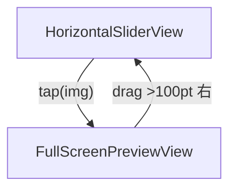

# MarinEE ― 1 対 1 チャット & "アプリ内フローティング無音ビデオ" 完全詳細設計書

(サーバー運用ゼロ / CloudKit + WebRTC-STUN のみ)

iOS17 以上日王できれば良いので、最新の機能を活用して、できるだけモダンなスマートな実装をお行う。

## 1. プロジェクト雛形

### 手順

| 項目                    | 値                                     |
| ----------------------- | -------------------------------------- |
| File ▸ New ▸ App        | -                                      |
| Product Name            | MarinEE                                |
| Organization Identifier | com.<あなたのドメイン> 例: com.example |
| Interface               | SwiftUI                                |
| Language                | Swift                                  |
| Storage                 | SwiftData                              |
| ✅ Host in CloudKit     | 必須                                   |

### Capabilities & 権限

| カテゴリ           | ON                                                    | OFF                  | 理由                  |
| ------------------ | ----------------------------------------------------- | -------------------- | --------------------- |
| iCloud             | CloudKit / Private DB                                 | -                    | データ同期            |
| Push Notifications | Dev + Prod                                            | -                    | サイレント通知        |
| Background Modes   | Remote notifications                                  | Audio / PiP など全て | BG は通知のみ         |
| Privacy.plist      | NSCameraUsageDescription = "無音ビデオ通話で映像共有" | マイク説明キーなし   | 音声送信しない        |
| Sign In            | Keychain 自動                                         | -                    | remoteUserID 保護保存 |

### 依存 Swift Package

- https://github.com/stasel/WebRTC.git (from 109.0.0)

---

## 2. データモデル

### 2.1 SwiftData

```swift
@Model
final class Message: Identifiable {
    @Attribute(.unique) var id: UUID
    var roomID: String
    var senderID: String  // 自分 or 相手
    var body: String
    var createdAt: Date
    var isSent: Bool
}
```

### 2.2 CloudKit スキーマ

| Record Type    | Fields                                          | 用途     |
| -------------- | ----------------------------------------------- | -------- |
| MessageCK      | roomID:String(index), senderID, body, createdAt | テキスト |
| CallSessionCK  | roomID(PK), offer:Data?, answer:Data?           | SDP      |
| IceCandidateCK | roomID(index), sdpMid, sdpMLineIndex, candidate | ICE      |
| PresenceCK     | roomID(index), userID, expires:Date             | 30s TTL  |

すべてプライベート DB / ChatZone

roomID = HMAC-SHA256(myID+remoteID) で 64 桁 HEX。

---

## 3. アプリ構成ビュー

```
WindowGroup
└─ RootSwitcher
    ├─ PairingView     ← 初回
    └─ ChatView
        └─ FloatingVideoOverlay (常駐)
```

### 3.1 PairingView

```swift
struct PairingView: View {
    @AppStorage("remoteUserID") private var remoteUserID = ""
    @State private var partnerID = ""

    var body: some View {
        VStack(spacing: 32) {
            TextField("相手の Apple ID / 電話番号", text: $partnerID)
                .textFieldStyle(.roundedBorder)
            Button("登録して開始") {
                remoteUserID = partnerID.trimmingCharacters(in: .whitespaces)
            }
            .disabled(partnerID.isEmpty)
        }
        .padding()
    }
}
```

### 3.2 RootSwitcher

```swift
@main
struct MarinEEApp: App {
    @AppStorage("remoteUserID") private var remoteUserID = ""

    var body: some Scene {
        WindowGroup {
            if remoteUserID.isEmpty {
                PairingView()
            } else {
                ChatView()
            }
        }
    }
}
```

---

## 4. Push・同期基盤

### 4.1 AppDelegate

```swift
final class AppDelegate: NSObject, UIApplicationDelegate, UNUserNotificationCenterDelegate {

    func application(_ app: UIApplication,
                     didFinishLaunchingWithOptions _: [UIApplication.LaunchOptionsKey: Any]? = nil) -> Bool {
        UNUserNotificationCenter.current().delegate = self
        app.registerForRemoteNotifications()
        Task { try? await CKSync.installSubscriptions() }
        return true
    }

    func application(_ app: UIApplication,
                     didReceiveRemoteNotification userInfo: [AnyHashable: Any]) async
           -> UIBackgroundFetchResult {
        return await CKSync.handlePush(userInfo)
    }
}
```

### 4.2 サブスクリプション生成

```swift
enum CKSync {
    static func installSubscriptions() async throws {
        let db = CKContainer.default().privateCloudDatabase
        for (type, id) in [("MessageCK","msg-sub"),
                           ("CallSessionCK","sig-sub"),
                           ("IceCandidateCK","ice-sub"),
                           ("PresenceCK","pre-sub")] {
            let sub = CKQuerySubscription(recordType: type,
                                         predicate: .init(value: true),
                                         subscriptionID: id,
                                         options: .firesOnRecordCreation)
            let info = CKSubscription.NotificationInfo()
            info.shouldSendContentAvailable = true
            sub.notificationInfo = info
            try await db.save(sub)
        }
    }
```

### 4.3 Push 受信 → 差分反映

```swift
    static func handlePush(_ userInfo: [AnyHashable: Any]) async -> UIBackgroundFetchResult {
        let db = CKContainer.default().privateCloudDatabase
        let changes = try? await db.afetchAllChanges()  // zone changes helper
        await MainActor.run {
            changes?.forEach { record in
                if let msg = MessageMapper.from(record) {
                    modelContext.insert(msg)
                }
                P2PController.shared.ingest(record)  // SDP / ICE / Presence
            }
        }
        return .newData
    }
}
```

---

## 5. チャット処理

### 5.1 送信

```swift
func sendMessage(_ text: String) {
    let m = Message(id: .init(),
                    roomID: roomID,
                    senderID: myID,
                    body: text,
                    createdAt: .now,
                    isSent: false)
    modelContext.insert(m)
    Task.detached {
        try await CKSync.saveMessage(m)
        await MainActor.run { m.isSent = true }
    }
}
```

### 5.2 ChatView UI

```swift
struct ChatView: View {
    @Query(filter: #Predicate<Message> { $0.roomID == roomID },
           sort: \.createdAt) var messages: [Message]
    @State private var text = ""

    var body: some View {
        ZStack(alignment: .topTrailing) {
            VStack {
                ScrollViewReader { proxy in
                    ScrollView {
                        LazyVStack {
                            ForEach(messages) { bubble(for: $0) }
                        }
                    }
                    .onChange(of: messages.last?.id) { id in
                        if let id {
                            proxy.scrollTo(id, anchor: .bottom)
                        }
                    }
                }
                HStack {
                    TextField("Message", text: $text)
                    Button("Send") {
                        sendMessage(text)
                        text = ""
                    }
                    .disabled(text.isEmpty)
                }
                .padding()
            }
            FloatingVideoOverlay()
        }
        .onAppear { P2PController.shared.startIfNeeded() }
        .onDisappear { P2PController.shared.close() }
    }
}
```

---

## 6. P2PController（WebRTC + Presence）

```swift
@MainActor
final class P2PController: ObservableObject {
    enum State { case idle, connecting, connected, failed }
    @Published private(set) var state: State = .idle
    @Published var localTrack: RTCVideoTrack?
    @Published var remoteTrack: RTCVideoTrack?

    private var pc: RTCPeerConnection!
    private var capturer: RTCCameraVideoCapturer!
    private var presenceTimer: AnyCancellable?
}
```

### 6.1 起動 & カメラ

```swift
func startIfNeeded() {
    guard state == .idle else { return }
    state = .connecting
    setupPeer()
    startLocalCamera()
    schedulePresence()
    maybeExchangeSDP()  // CloudKit 経由 (Host/Guest 自動判定)
}
```

### 6.2 PeerConnection & Delegates

```swift
func setupPeer() {
    let f = RTCPeerConnectionFactory()
    var cfg = RTCConfiguration()
    cfg.iceServers = [RTCIceServer(urlStrings: ["stun:stun.l.google.com:19302"])]
    pc = f.peerConnection(with: cfg, constraints: .init(), delegate: self)
}

func startLocalCamera() {
    let f = RTCPeerConnectionFactory()
    let source = f.videoSource()
    capturer = RTCCameraVideoCapturer(delegate: source)
    localTrack = f.videoTrack(with: source, trackId: "local0")
    let ms = f.mediaStream(with: "stream0")
    ms.addVideoTrack(localTrack!)
    pc.add(ms)

    guard
        let device = RTCCameraVideoCapturer.captureDevices()
                     .first(where: { $0.position == .front }),
        let format = RTCCameraVideoCapturer.supportedFormats(for: device)
                     .first(where: { CMFormatDescriptionGetDimensions($0.formatDescription).width >= 640 }),
        let fps = format.videoSupportedFrameRateRanges.first?.maxFrameRate
    else { return }

    capturer.startCapture(with: device, format: format, fps: Int(fps/2))
}
```

### Delegate 抜粋

```swift
extension P2PController: RTCPeerConnectionDelegate {
    func peerConnection(_ pc: RTCPeerConnection, didAdd stream: RTCMediaStream) {
        if let track = stream.videoTracks.first {
            remoteTrack = track
            if localTrack != nil {
                FloatingVideoOverlayBridge.activate()
            }
        }
    }

    func peerConnection(_ pc: RTCPeerConnection,
                        didChange state: RTCPeerConnectionState) {
        self.state = (state == .connected) ? .connected
                   : (state == .failed ? .failed : self.state)
    }

    func peerConnection(_ pc: RTCPeerConnection,
                        didGenerate candidate: RTCIceCandidate) {
        Task {
            try? await CKSync.saveCandidate(candidate, roomID: roomID)
        }
    }
}
```

### 6.3 Presence

```swift
func schedulePresence() {
    presenceTimer = Timer.publish(every: 25, on: .main, in: .common)
        .autoconnect()
        .sink { _ in
            CKSync.refreshPresence(roomID, myID)
        }
}
```

expires = now + 30。失効検知で close() を呼ぶ。

### 6.4 終了

```swift
func close() {
    presenceTimer?.cancel()
    capturer.stopCapture()
    pc?.close()
    localTrack = nil
    remoteTrack = nil
    state = .idle
}
```

---

## 7. FloatingVideoOverlay ― アプリ内 PiP

### 7.1 UIViewRepresentable

```swift
struct RTCVideoView: UIViewRepresentable {
    let track: RTCVideoTrack

    func makeUIView(context: Context) -> RTCMTLVideoView {
        RTCMTLVideoView()
    }

    func updateUIView(_ ui: RTCMTLVideoView, context: Context) {
        track.add(ui)
    }
}
```

### 7.2 オーバーレイ

```swift
struct FloatingVideoOverlay: View {
    @ObservedObject private var p2p = P2PController.shared
    @State private var offset: CGSize = .zero
    @State private var isExpanded = false

    var body: some View {
        if let remote = p2p.remoteTrack,
           let local = p2p.localTrack,
           p2p.state == .connected {

            ZStack(alignment: .topTrailing) {
                RTCVideoView(track: remote)
                    .aspectRatio(9/16, contentMode: .fill)
                    .clipped()

                RTCVideoView(track: local)
                    .frame(width: 96, height: 128)
                    .clipShape(RoundedRectangle(cornerRadius: 8))
                    .padding(8)
            }
            .frame(width: isExpanded ? 240 : 140,
                   height: isExpanded ? 320 : 200)
            .background(.black.opacity(0.6))
            .clipShape(RoundedRectangle(cornerRadius: 12))
            .shadow(radius: 4)
            .offset(offset)
            .gesture(DragGesture().onChanged { offset = $0.translation })
            .onTapGesture {
                withAnimation(.spring()) {
                    isExpanded.toggle()
                }
            }
            .padding(16)
            .transition(.scale.combined(with: .opacity))
        }
    }
}
```

---

## 8. FaceTime 手動発信

```swift
struct FaceTimeButton: View {
    @Environment(\.openURL) private var openURL
    let callee: String

    var body: some View {
        Button {
            P2PController.shared.close()  // エコー抑止
            openURL(URL(string: "facetime://\(callee)")!)
        } label: {
            Image(systemName: "video.circle.fill")
        }
    }
}
```

---

## 9. セキュリティ & プライバシー

| 項目         | 内容                                             |
| ------------ | ------------------------------------------------ |
| シグナリング | CloudKit TLS + ユーザー固有 DB                   |
| メディア     | WebRTC DTLS-SRTP（エンドツーエンド暗号化）       |
| 収集データ   | カメラ映像のみ・音声ゼロ                         |
| 保存         | remoteUserID を Keychain (ThisDeviceOnly) に格納 |
| 第三者転送   | なし（P2P 直接）                                 |

---

## 10. テストチェックリスト

1. 初回ペアリング → ChatView へ遷移
2. メッセージ送信 → ローカル即表示 → 相手端末へ push → UI 反映
3. 双方 ChatView 表示で 1〜2 秒以内にフローティングビデオ出現
4. サムネイルをドラッグ → 位置保持、タップ → 拡大縮小
5. ホーム画面へ移動 → 接続停止 / カメラ消灯 → 復帰で自動再接続
6. マイク権限プロンプトが一切出ない
7. FaceTime ボタン押下でビデオ閉じてから FaceTime 起動

## 11. 画像プレビュー ― 横スライダー → ヒーロー遷移 → ズーム／一括保存 (iOS 17+)

### 11.1 機能概要

- **目的**: チャット内やギャラリーからタップした画像を、フルスクリーンで“ヌルッ”と拡大表示し、横スワイプで他画像へ移動できる UI を実現する。
- **対象 OS**: iOS 17 以降。
- **特徴**:
  1. 追加ライブラリ不要。SwiftUI 純正 API 100%。
  2. `NavigationTransition(.zoom)` によるヒーローアニメーション。
  3. `ScrollTargetBehavior(.viewAligned)` の Filmstrip スライダー。
  4. ピンチズーム + ドラッグで閲覧。拡大率 1 以下で元位置に自動リセット。
  5. ダウンロードボタン 1 つで、単数／複数を自動判定し確認アラートを表示。

### 11.2 画面構成・遷移



- `NavigationStack` を用い、`NavigationLink(value:)` で `Int` 型 index を `path` に投入。
- `navigationDestination(for: Int.self)` でインデックスを受け取り、`FullScreenPreviewView` をプッシュ。
- ヒーロー効果は `.navigationTransition(.zoom)` で実現し、コード 1 行で完結。

### 11.3 コンポーネントと責務

| ファイル                       | 型                      | 責務                                                                               |
| ------------------------------ | ----------------------- | ---------------------------------------------------------------------------------- |
| `ImagePreviewComponents.swift` | `ImageSliderRoot`       | ルート。`UIImage` 配列を受け取り、`NavigationStack` を構成するエントリーポイント。 |
|                                | `HorizontalSliderView`  | 横スクロールサムネイル。`NavigationLink` でプレビューへ遷移。                      |
|                                | `FullScreenPreviewView` | `TabView(.page)` + ピンチズーム。右ドラッグ >100pt で閉じる。                      |
|                                | `ZoomableImage`         | `PhaseAnimator` + `ZoomGestureModifier` でズーム／ドラッグ実装。                   |
|                                | `ZoomGestureModifier`   | `MagnificationGesture` & `DragGesture` を合成し、移動・縮小判定。                  |

### 11.4 保存処理

- 単一画像: 直接 `UIImageWriteToSavedPhotosAlbum`。
- 複数画像: 確認アラート → ループ保存。
- **Info.plist** に `NSPhotoLibraryAddUsageDescription` を追加し、文言「アルバムへ画像を保存します」を設定。

### 11.5 テストチェックリスト (追加)

1. スライダーから画像タップ → ヒーロー拡大後、スライダー画像がスムーズにズーム連携。
2. 横スワイプでページ送り → インジケータが更新される。
3. ピンチアウト >1.5 倍 → 画像拡大、ドラッグ移動可能。
4. ピンチインで 1x 未満に戻ると自動的に原点へスナップ。
5. 右方向スワイプ (>100pt) でプレビュー終了し、元のサムネイル位置に戻る。
6. ダウンロードボタン:
   - 単数画像 → 即保存、トースト / アラート表示。(※実装による)
   - 複数画像 → "n 件すべてダウンロードしますか？" アラート。
7. 端末の写真ライブラリに画像が保存されることを確認。

## 12. デュアルカメラ同時撮影機能 ― フロント＋リア同時録画

### 12.1 機能概要

- **目的**: チャット入力バーのカメラアイコンから、インカメラとアウトカメラをリアルタイムに PIP 表示しながら同時録画し、1 本の動画ファイル (HEVC `.mov`) に合成する。録画完了後はレビュー画面へ遷移し、ユーザーが「送信」または「閉じる」を選択できる (閉じる時は保存有無を確認)。
- **対象 OS / デバイス**: iOS 17 以降、A12 Bionic 以上で _`AVCaptureMultiCamSession.isMultiCamSupported == true`_ の端末。
- **特徴**:
  1. _AVCaptureMultiCamSession_ によるハードウェア同時撮影 (追加ライブラリ不要)。
  2. Metal (もしくは CoreImage) でリアルタイム合成し、_AVAssetWriter_ で単一トラックへエンコード。
  3. レビュー画面で「送信」を選択すると写真アプリへ保存し、チャットに添付 (isSent=false)。
  4. ピクチャ-イン-ピクチャ (背面: 全画面 / 前面: 右上 160×213px) レイアウトを初期値とし、\*カメラ切替アイコン\*で 2 つの映像サイズを瞬時に反転。
  5. 内蔵マイクから AAC 48kHz ステレオ録音し、ビデオと同期。

### 12.2 UI 変更点

| 画面             | 追加／変更                                                             |
| ---------------- | ---------------------------------------------------------------------- |
| ChatView         | 送信バー左に `CameraDualIcon` (camera.fill.badge.plus) を追加          |
| DualCamModalView | 全画面。リアルタイム PIP プレビュー + 録画ボタン・タイマー・カメラ切替 |
| VideoReviewView  | 録画後の再生・「送信」・「閉じる」ボタン                               |

```swift
struct CameraDualButton: View {
    @State private var showRecorder = false
    var body: some View {
        Button {
            showRecorder = true
        } label: {
            Image(systemName: "camera.fill.badge.plus")
        }
        .fullScreenCover(isPresented: $showRecorder) {
            DualCamRecorderView()
        }
    }
}
```

### 12.3 アーキテクチャ

```mermaid
flowchart TD
    A[DualCamRecorderView] --> B[DualCameraRecorder]
    B --> C1[AVCaptureMultiCamSession]
    B --> C2[VideoFrameMixer (Metal)]
    C2 --> D[AVAssetWriter]
```

- **DualCamRecorderView**: SwiftUI, プレビュー表示・UI 操作。
- **DualCameraRecorder (ObservableObject)**: セッション・録画制御。`@Published var previewImage: CGImage?` を Combine でストリーム。
- **VideoFrameMixer**: `CMSampleBuffer` 2 系統を Metal シェーダで合成。遅延 ≤16ms を目標。

### 12.4 録画フロー

1. `start()`
   - 権限チェック / 取得 (`AVCaptureDevice.requestAccess`)。
   - `AVCaptureMultiCamSession` 構築: _backWide_ + _frontWide_ 入力。
   - 各入力に `AVCaptureVideoDataOutput` を接続し、`setSampleBufferDelegate` で取得。
   - `VideoFrameMixer` へ渡し、合成 `CVPixelBuffer` を `AVAssetWriterInputPixelBufferAdaptor` に投入。
2. `stop()`
   - セッション停止 → _AVAssetWriter.finishWriting_ コールバックで **一時ディレクトリ**に `.mov` を出力。
   - `VideoReviewView(tempURL)` をモーダル表示し、再生プレビューを提供。
   - ユーザー操作:
     - 「送信」: `PHPhotoLibrary.shared().performChanges` で保存 → `Message(body:"video://<localIdentifier>")` を挿入 (`isSent=false`)。
     - 「閉じる」: アラート "この動画をアルバムに保存しますか？" → YES で保存、NO でファイル削除。

### 12.5 ファイル仕様

| 項目       | 値                            |
| ---------- | ----------------------------- |
| コンテナ   | ISO BMFF (`.mov`)             |
| ビデオ     | H.265/HEVC, 1920×1080@30      |
| オーディオ | AAC 48kHz Stereo (内蔵マイク) |
| メタデータ | orientation / location        |

### 12.6 エラーハンドリング & フォールバック

- _isMultiCamSupported == false_ → アラート表示し単一カメラモードへフォールバック (背面のみ)。
- エンコード失敗時 → ファイル破棄 & トースト表示「録画に失敗しました」。

### 12.7 Info.plist 追加キー

| Key                                      | Value                                    |
| ---------------------------------------- | ---------------------------------------- |
| NSCameraUsageDescription                 | "動画撮影にカメラを使用します"           |
| NSMicrophoneUsageDescription             | "デュアルカメラ動画にマイクを使用します" |
| NSSaveToCameraRollUsageDescription (17+) | "撮影した動画をアルバムに保存します"     |

### 12.8 テストチェックリスト (追加)

1. カメラアイコンタップ → デュアルプレビュー表示。
2. 録画開始 5 秒 → 停止 → 写真アプリに 1 ファイル保存される。
3. チャットに動画サムネイルが即時表示される (isSent=false)。
4. 送信完了後、相手端末で再生可能。
5. デバイスが multi-cam 非対応の場合、背面のみで録画可能。
6. レビュー画面で閉じる → 保存確認ダイアログが表示され、選択に応じて保存／破棄される。

## 13. リアクションピッカー ― “Instagram-Like” 絵文字リアクション

### 13.1 UX フロー

| フェーズ          | 指の状態        | 画面挙動                                                                                  | 備考                                  |
| ----------------- | --------------- | ----------------------------------------------------------------------------------------- | ------------------------------------- | ---------------------------- | -------------- |
| A. 開始           | 長押し 0.35s    | • ピッカー `spring+fade-in` で出現<br>• リスト `scrollDisabled(true)`<br>• Haptic `.soft` | `.sequencedGesture` で LongPress→Drag |
| B. 選択           | 指を左右 Drag   | • X 位置 → index<br>• 対象絵文字 `scale 1.4` + Bold<br>• Index 変化毎に Haptic `.light`   | `GestureState` で監視                 |
| C. キャンセル準備 | 指を上下 ±150pt | 不透明度 `1-min(                                                                          | ΔY                                    | /150,0.8)`                   | 0.2 までは残す |
| D. 確定/取消      | 指を離す        |                                                                                           | ΔY                                    | <60 → 確定／≥60 → キャンセル |                |

### 13.2 コンポーネント構成

```
MessageBubble
└─ .popover(ReactionPickerView)
    ├─ HStack(EmojiItem)
    └─ DragGesture(minDistance:0)
```

_MessageBubble_ では `.popover` を使用し、バブル直上に添付。表示時は `scrollLocked = true`。

### 13.3 ReactionPickerView.swift（抜粋）

```swift
GeometryReader { geo in
    HStack(spacing: 20) {
        ForEach(items.indices, id: \.self) { idx in
            itemView(idx)
                .scaleEffect(idx == index ? 1.4 : 1)
                .animation(.easeInOut(duration: 0.08), value: index)
        }
    }
    .opacity(opacity(for: drag.height))
    .gesture(
        DragGesture(minimumDistance: 0)
            .updating($drag) { v, s, _ in s = v.translation }
            .onChanged { updateHighlight(x: $0.location.x, width: geo.size.width) }
            .onEnded   { finish($0, geo: geo) }
    )
}
.frame(height: 60)
```

### 13.4 状態管理

```swift
@Observable final class ChatUIState {
    var reactingMsgID: UUID? = nil
    var scrollLocked  = false
}
```

各 View は `environment(chatUIState)` を注入。

### 13.5 データ書込

_確定_: `message.reactionEmoji = emoji` → `CKSync.saveReaction(_)`

_＋_: フル絵文字ピッカー `.sheet` 起動

_キャンセル_: 何もしない

### 13.6 アニメーション & Haptic

| タイミング | API                                                                                          |
| ---------- | -------------------------------------------------------------------------------------------- |
| 出現/消失  | `.transition(.scale.combined(with:.opacity))` + `.spring(response:0.35,dampingFraction:0.8)` |
| Index 変更 | `UIImpactFeedbackGenerator(style:.light)`                                                    |

### 13.7 レイアウト調整

ピッカー表示中は

```swift
.padding(.top, 60).padding(.bottom, 60)
.scrollDisabled(true)
```

ヘッダーや入力欄に被らない。

### 13.8 テストチェックリスト

1. 長押し → ピッカー表示 & スクロール停止
2. 左右 Drag でハイライト & Haptic
3. 上下 Drag で透過
4. 60pt 未満で確定、以上でキャンセル
5. ＋ 選択でフルピッカー
6. バブル右下にリアクション表示
7. recentEmojis が LRU 更新
8. UI がヘッダー/入力欄に被らない

---

### 13.9 実装設計（iOS 17+）

> GetStream / Like-Reactions-Button の実装は参考に留め、SwiftUI の最新 API をフル活用してゼロベースで構築する方針。

#### 1) 基本設計

- **表示絵文字数**: 最近使った 3 つ + プラスボタンのみ（計 4 アイテム）
- **任意選択**: プラスボタンタップ時は既存の `MCEmojiPickerSheet` を流用
- **対象 OS**: iOS 17 以上（フォールバック実装は不要）

#### 2) 状態管理

```swift
@Observable
final class ReactionStore {
    // メッセージごとのリアクション
    var reactions: [UUID: String] = [:]

    // 最近使った絵文字（最大3つ）
    @AppStorage("recentReactionEmojis")
    var recentEmojis: String = "👍,❤️,😂"

    // リアクション表示中のメッセージID
    var reactingMessageID: UUID? = nil

    // ドラッグ中のハイライトインデックス
    var highlightedIndex: Int = 0

    // 上下ドラッグによる透明度
    var opacity: Double = 1.0

    func addReaction(_ emoji: String, to messageID: UUID) {
        reactions[messageID] = emoji
        updateRecentEmojis(with: emoji)
    }

    private func updateRecentEmojis(with emoji: String) {
        var recent = recentEmojis.split(separator: ",").map(String.init)
        recent.removeAll { $0 == emoji }
        recent.insert(emoji, at: 0)
        recentEmojis = recent.prefix(3).joined(separator: ",")
    }
}
```

#### 3) ビュー構成

```swift
// メッセージバブル
MessageBubble
├─ .onLongPressGesture { store.reactingMessageID = message.id }
└─ .popover(isPresented: .constant(store.reactingMessageID == message.id),
            attachmentAnchor: .point(.top)) {
     ReactionPickerView()
         .presentationCompactAdaptation(.none)
   }
```

#### 4) ReactionPickerView 実装

```swift
struct ReactionPickerView: View {
    @Environment(ReactionStore.self) private var store
    @GestureState private var dragTranslation: CGSize = .zero
    @State private var showEmojiPicker = false

    private var recentEmojis: [String] {
        store.recentEmojis.split(separator: ",").map(String.init)
    }

    var body: some View {
        HStack(spacing: 20) {
            // 最近使った絵文字
            ForEach(Array(recentEmojis.enumerated()), id: \.offset) { index, emoji in
                Text(emoji)
                    .font(.system(size: 28))
                    .scaleEffect(store.highlightedIndex == index ? 1.3 : 1.0)
                    .animation(.spring(response: 0.3, dampingFraction: 0.7),
                              value: store.highlightedIndex)
            }

            // プラスボタン
            Image(systemName: "plus.circle")
                .font(.system(size: 24))
                .foregroundStyle(.secondary)
                .scaleEffect(store.highlightedIndex == 3 ? 1.3 : 1.0)
                .animation(.spring(response: 0.3, dampingFraction: 0.7),
                          value: store.highlightedIndex)
        }
        .padding(.horizontal, 16)
        .padding(.vertical, 12)
        .background(.ultraThinMaterial)
        .clipShape(Capsule())
        .opacity(store.opacity)
        .gesture(reactionGesture)
        .sheet(isPresented: $showEmojiPicker) {
            MCEmojiPickerSheet { selectedEmoji in
                if let messageID = store.reactingMessageID {
                    store.addReaction(selectedEmoji, to: messageID)
                }
                store.reactingMessageID = nil
            }
        }
    }

    private var reactionGesture: some Gesture {
        DragGesture(minimumDistance: 0)
            .updating($dragTranslation) { value, state, _ in
                state = value.translation
            }
            .onChanged { value in
                // 横位置からインデックスを計算
                updateHighlight(at: value.location)

                // 縦移動で透明度を調整
                let absY = abs(value.translation.height)
                store.opacity = max(0.2, 1 - (absY / 150))
            }
            .onEnded { value in
                let absY = abs(value.translation.height)

                if absY > 60 {
                    // キャンセル
                    store.reactingMessageID = nil
                } else {
                    // 選択確定
                    confirmSelection()
                }

                // 状態リセット
                store.opacity = 1.0
                store.highlightedIndex = 0
            }
    }

    private func updateHighlight(at location: CGPoint) {
        // ジオメトリから適切なインデックスを計算
        // 実装詳細は省略
    }

    private func confirmSelection() {
        guard let messageID = store.reactingMessageID else { return }

        if store.highlightedIndex < recentEmojis.count {
            // 絵文字選択
            let emoji = recentEmojis[store.highlightedIndex]
            store.addReaction(emoji, to: messageID)
            store.reactingMessageID = nil

            // Haptic feedback
            UIImpactFeedbackGenerator(style: .light).impactOccurred()
        } else if store.highlightedIndex == 3 {
            // プラスボタン
            showEmojiPicker = true
        }
    }
}
```

#### 5) アニメーション詳細

- **出現**: `.popover` の自動アニメーションを活用
- **ハイライト**: `spring(response: 0.3, dampingFraction: 0.7)` で自然な動き
- **透明度変化**: `opacity = max(0.2, 1 - (|ΔY| / 150))` で 0.2 まで
- **Haptic**: 選択時に `.light` スタイルでフィードバック

#### 6) ChatView での統合

```swift
struct ChatView: View {
    @Environment(ReactionStore.self) private var reactionStore

    var body: some View {
        ScrollView {
            LazyVStack {
                ForEach(messages) { message in
                    MessageBubbleView(message: message)
                        .overlay(alignment: .bottomTrailing) {
                            if let reaction = reactionStore.reactions[message.id] {
                                Text(reaction)
                                    .font(.system(size: 16))
                                    .padding(4)
                                    .background(Circle().fill(.thinMaterial))
                                    .transition(.scale.combined(with: .opacity))
                            }
                        }
                }
            }
        }
        .scrollDisabled(reactionStore.reactingMessageID != nil)
    }
}
```

#### 7) 実装のポイント

- **シンプルさ重視**: 4 つのボタンのみなので複雑な最適化は不要
- **既存資産の活用**: `MCEmojiPickerSheet` と `QuickEmojiBar` の絵文字を共有
- **一貫性**: 入力欄とリアクションで同じ最近使った絵文字を使用
- **アクセシビリティ**: VoiceOver での絵文字読み上げに対応

#### 8) テスト項目

1. 長押し → ピッカー表示とスクロール停止
2. 左右ドラッグでハイライト切り替えと Haptic
3. 上下 60pt 以上でキャンセル、未満で選択確定
4. プラスボタンで `MCEmojiPickerSheet` 表示
5. リアクション絵文字がバブル右下に表示
6. 最近使った絵文字の更新と永続化

これにより、Instagram 風の流体的なリアクション体験を、シンプルで保守しやすい実装で実現します。
